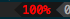
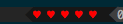

# A battey segment for Powerline

If you don't know [Powerline](http://github.com/lokaltog/powerline) yet, go for it.

## Limitations

* Works only on OSX. Tested on Mountain Lion only. _You tell me._

##Installation

    pip install -U --user git+https://github.com/xcambar/powerline-segment-battery.git

And then add this to your prefered spot under `segments`:

    {
        "module": "xcambar.segment.battery",
        "name": "battery"
    },

## Configuration

2 displays are available:

* `numeric`: Displays the percentage of battery remaining with a `%` aside 
* `symbol`: Allows you to display a number of characters indicating visually the level of battery remaining 

See the file `xcambar/segment/battery.py` for the available options.

## Acknowledgements

Thanks to @Lokaltog for Powerline.

Thanks also to @omega for his demo of a custom Poserline segment. It would have tough
(if even possible) without this example.

## License

MIT

